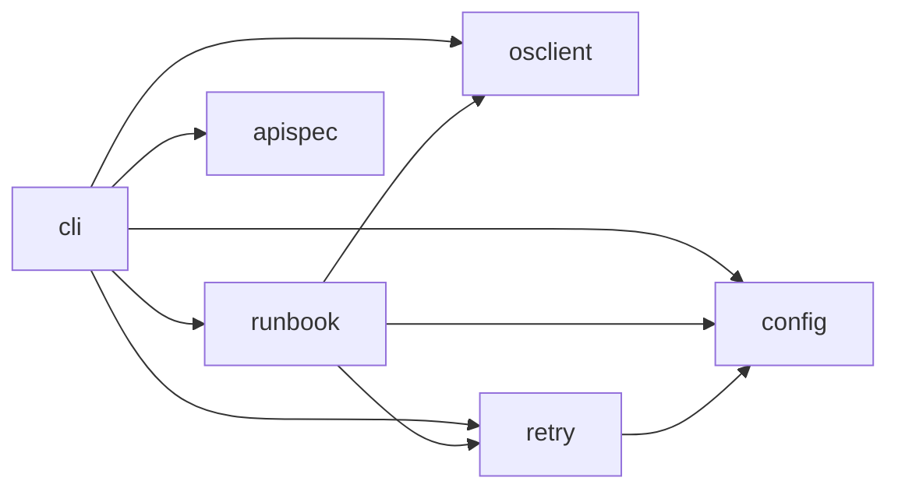
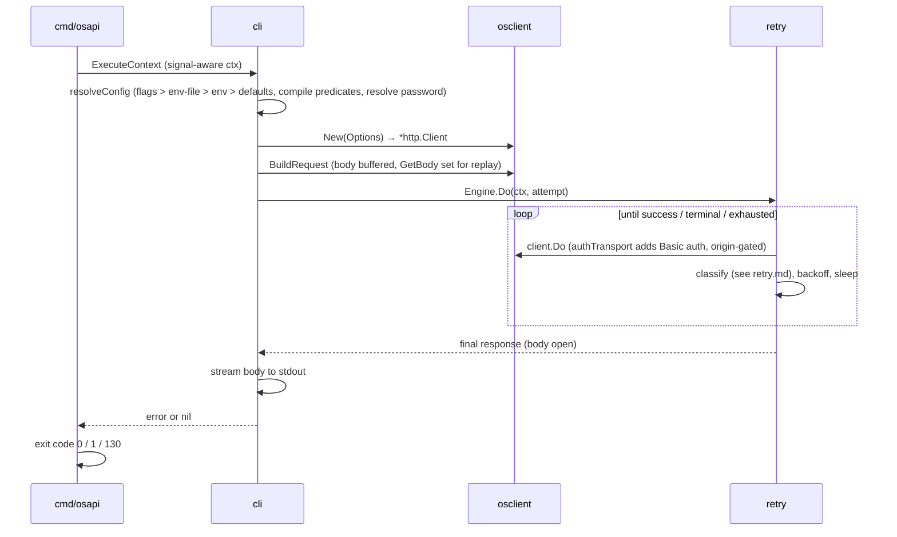

[← back to README](../README.md)

# Architecture

This page is for contributors. It explains how the packages compose and why
key decisions were made. For what the tool *does*, read
[cli.md](cli.md), [retry.md](retry.md), and [runbooks.md](runbooks.md).

## Package map

| Package | Responsibility |
| ------- | -------------- |
| [`cmd/osapi`](../cmd/osapi/) | entry point: signal handling, error printing, exit-code mapping |
| [`internal/cli`](../internal/cli/) | cobra command tree, flag registration, shell completion, dry-run plan printing |
| [`internal/config`](../internal/config/) | flag/env/env-file/default resolution, backoff and size parsing, password prompt |
| [`internal/osclient`](../internal/osclient/) | `*http.Client` for one endpoint (TLS, origin-gated Basic auth) and raw request building |
| [`internal/retry`](../internal/retry/) | the retry engine: outcome classification, backoff, compiled jq predicates |
| [`internal/runbook`](../internal/runbook/) | YAML runbook loading/validation, execution, capture and `${name}` substitution |
| [`internal/apispec`](../internal/apispec/) | compiled-in OpenSearch REST surface for completion and `--body-skeleton` |
| [`internal/apispec/gen`](../internal/apispec/gen/) | build-time generator (separate Go module, not shipped) |
| [`e2e`](../e2e/) | black-box tests against a real OpenSearch, behind the `e2e` build tag |

## Dependency rule

`cli` orchestrates; the packages below it do not know about cobra or each
other's callers. `osclient` and `apispec` are standalone. `apispec/gen` is a
separate module so its OpenAPI parser never enters the shipped binary's
dependency graph.

## Single-request flow

`osapi --path ...` flows through four packages:

## Runbook flow

1. `runbook.LoadFile` parses the YAML, layers `defaults:` onto each call,
   compiles every jq expression, and validates every `${name}` reference in a
   single left-to-right walk. A reference may only name a capture declared by
   an earlier call, which also rules out cycles without a graph walk.
2. `--dry-run` returns here: `cli.printPlan` prints the plan. No endpoint, no
   password, no network.
3. `runbook.Runner.Run` executes calls in document order. Per call:
   substitute `${name}` values → build the request → `retry.Engine.Do` →
   report the outcome → extract captures into the store.
4. The first non-tolerated failure halts the run. The summary prints to
   stderr either way.

## Design decisions

Each entry: the decision, why, and where it lives.

- **The root command is the request.** No `request` subcommand — the common
  case gets the shortest spelling. `internal/cli/root.go`.
- **stdout carries the response body only.** Everything else — progress,
  warnings, errors — goes to stderr, so output stays pipeable to `jq`. In
  `run` mode stdout is reserved (empty) for a future `--output`.
  `internal/cli`, `internal/runbook/run.go`.
- **Classification order is load-bearing.** `--abort-on` (non-2xx only) beats
  the predicates; `--retry-when` beats `--success-when` because a failure
  indicator must win over a success gate. The order lives in one function:
  `internal/retry/classify.go`. Documented normatively in [retry.md](retry.md).
- **Request bodies are always fully buffered** so `req.GetBody` can replay
  them on retry. Response bodies are buffered only when a predicate needs
  them, capped by `max-body-buffer`, and the buffered prefix is stitched back
  with `io.MultiReader` so stdout never sees a truncated body.
  `internal/osclient/request.go`, `internal/retry/retry.go: bufferBody`.
- **Basic auth is origin-gated.** Credentials attach only when the request
  matches the configured endpoint's scheme, host, and port, so a redirect to
  another origin never receives them. Userinfo is stripped from endpoint URLs
  before they can reach an error message.
  `internal/osclient/client.go: authTransport`.
- **Captures are scalar-only and inserted verbatim.** Auto-quoting would
  guess wrong somewhere; jq's `@json`/`tojson` give the author explicit
  control. The one exception is `path`: a substituted value may not contain
  `/ ? # %`, and a substituted path may not gain a `.`/`..` segment — a
  captured value must not redirect the request.
  `internal/runbook/capture.go: substitutePath`.
- **One scanner for load-time checks and runtime substitution.**
  `scanTemplate` is shared by reference validation and substitution, so the
  two can never disagree about what counts as a `${name}` reference.
  `internal/runbook/capture.go`.
- **`defaults:` layering is per-kind.** Scalars override on presence (even
  zero), lists replace wholesale, `query`/`headers` maps merge per key —
  headers by canonical name, so two case-spellings cannot ship as two
  headers. `internal/runbook/runbook.go: loader.call, mergeHeaders`.
- **The API spec is compiled in, not fetched.** Completion and
  `--body-skeleton` read generated Go (`paths_gen.go`, `body_gen.go`), so the
  binary needs no network or spec file at runtime. The cost is a manual
  refresh workflow (below). `internal/apispec`.
- **Errors are returned, not printed** — except `reportedError`, which marks
  an error the runbook Runner already wrote to stderr, so `main` does not
  print it twice. Exit codes: `0` success, `130` on `context.Canceled`
  (Ctrl-C/SIGTERM), `1` otherwise. `internal/cli/run.go`,
  `cmd/osapi/main.go: exitCode`.
- **The HTTP client has no `Timeout`.** Cancellation is driven by the request
  context, which the signal handler and retry engine own.
  `internal/osclient/client.go: New`.

## Testing layout

- Unit tests sit next to the code. Each OpenSearch API interaction gets its
  own `httptest`-based test.
- `e2e/` holds black-box tests behind the `e2e` build tag. They exec the
  built `osapi` binary against a Dockerized OpenSearch with the security
  plugin and TLS. See [e2e/README.md](../e2e/README.md); run with `make e2e`.
- `internal/cli/examples_test.go` dry-runs every runbook in
  [`examples/`](../examples/), so the examples cannot rot.

## Maintenance

### Updating the API spec

1. Bump `SPEC_VERSION` in the [`Makefile`](../Makefile).
2. Run `make update-spec`. It downloads the spec and its license into
   `internal/apispec/spec/` and regenerates `paths_gen.go`/`body_gen.go`.
3. Review the generated diff.
4. Update the version and commit SHA in [`NOTICE`](../NOTICE).

The spec YAML is gitignored — only the generated Go is committed. When you add
a dependency, add a `NOTICE` entry for anything bundled or vendored.

### Where documentation goes

One destination per kind of change, so the README stays a front door:

| Change | Document it in |
| ------ | -------------- |
| new or changed flag | [cli.md](cli.md) (the only flag table) |
| retry/classification behaviour | [retry.md](retry.md) |
| runbook key or semantics | [runbooks.md](runbooks.md), plus an example in [`examples/`](../examples/) when it earns one |
| package structure or a design decision | this file |
| pitch, install, quickstart | [README](../README.md) — nothing else belongs there |

Every mermaid diagram sits next to a table or list carrying the same facts:
diagrams do not render in terminals or `go doc`, so they are aids, never the
only statement of a rule.

## See also

- [retry.md](retry.md) — the classification model this code implements
- [runbooks.md](runbooks.md) — the run-file semantics
- [e2e/README.md](../e2e/README.md) — the end-to-end stack
