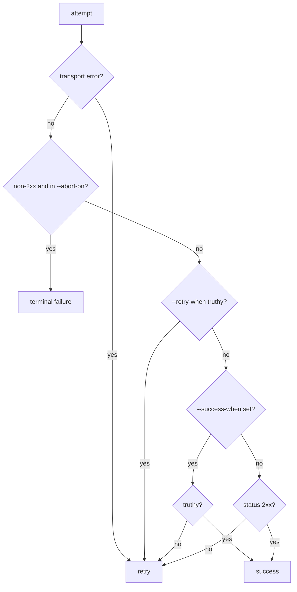

[← back to README](../README.md)

# Retry and outcome classification

`osapi` classifies every attempt as **success**, **retry**, or **terminal
failure**. This page is the normative description of that model. It applies
identically to single requests (flags) and to runbook calls (YAML keys) — see
[Run files](runbooks.md) for the YAML spelling.

## Attempt budget

- `--retry N` performs `1 + N` attempts.
- `--retry 0` (the default) makes a single attempt with no retry.
- `--retry -1` retries until the attempt is classified a success or terminal.

## Classification

Each attempt is classified by the first matching rule, top to bottom:

| # | Condition | Outcome |
| - | --------- | ------- |
| 1 | transport error (connection refused, TLS failure, timeout) | retry |
| 2 | **non-2xx** status listed in `--abort-on` | terminal failure |
| 3 | `--retry-when` is truthy | retry (even on a 2xx) |
| 4 | `--success-when` is set and truthy | success (regardless of status) |
| 5 | `--success-when` is set and falsy | retry (regardless of status) |
| 6 | status is 2xx | success |
| 7 | anything else | retry |

The same rules as a diagram (the table above is normative):

Consequences worth spelling out:

- A truthy `--success-when` on a `503` is a **success**.
- A falsy `--success-when` on a `200` is a **retry**.
- `--abort-on` beats both predicates — but only for non-2xx statuses.
  `--abort-on 200` does nothing: a 2xx can never be terminal.
- `--retry-when` beats `--success-when`: a failure indicator wins over a
  success gate.

## jq predicates

`--retry-when` and `--success-when` are jq expressions, evaluated against the
parsed JSON response body. Truthiness follows jq: every value is truthy except
`null` and `false`. So `0`, `""`, `[]`, and `{}` all count as truthy.

## Body buffering

Evaluating a predicate requires buffering the response body. Buffering happens
only when at least one predicate is set, up to `--max-body-buffer` (default
`10MiB`; `0` means unlimited).

A body that is over the cap, empty, or not valid JSON skips predicate
evaluation for that attempt. `osapi` prints a warning on stderr (even without
`-v`) and treats it as `--retry-when` not matched / `--success-when` not
satisfied.

Buffering never truncates what reaches stdout. The buffered prefix is stitched
back onto the unread remainder, so the final attempt's body prints in full
even when it is over the cap.

## Backoff

The delay before retry number *n*:

| Strategy      | Delay                    |
| ------------- | ------------------------ |
| `constant`    | `initial`                |
| `linear`      | `initial × n` (default)  |
| `exponential` | `initial × 2^(n−1)`      |

Every delay is capped at `--backoff-max`. `--backoff-jitter F` (a fraction in
`[0,1)`) then scales the delay by a random factor in roughly `[1−F, 1+F]`, so
concurrent invocations do not retry in lockstep. The jitter factor is clamped
above zero: a positive delay can never collapse to zero and produce a hot
retry loop.

Defaults: `linear`, `--backoff-initial 2s`, `--backoff-max 30s`, no jitter.

## Errors and exit codes

On any non-success outcome the exit code is `1`. Ctrl-C or SIGTERM exits
`130`. The response body **always** prints to stdout, including for failing
responses, so you can inspect `4xx`/`5xx` payloads or a body a predicate
rejected.

The stderr error names the deciding classification rule:

| Message | Meaning |
| ------- | ------- |
| `terminal status <code>: terminal status` | rule 2: an `--abort-on` status ended the attempt loop |
| `after <n> attempts: retries exhausted: --retry-when matched` | rule 3 decided the final attempt |
| `after <n> attempts: retries exhausted: --success-when not satisfied` | rule 5 decided the final attempt |
| `after <n> attempts: retries exhausted: <transport error>` | rule 1 decided the final attempt |
| `after <n> attempts: retries exhausted` | rule 7: plain non-2xx status |

## See also

- [Command reference](cli.md) — the retry flags in context
- [Run files](runbooks.md) — the same model driven from YAML
